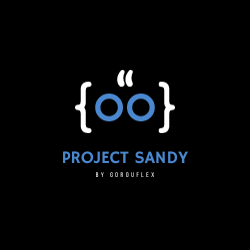
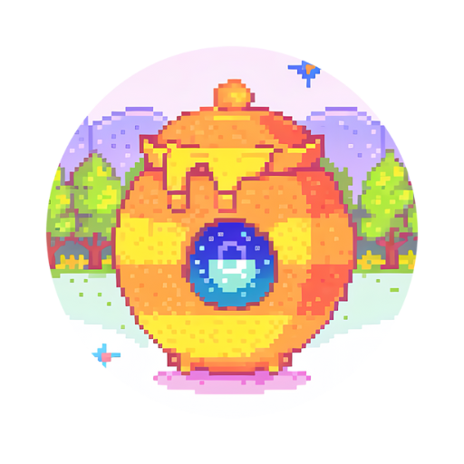

            

<h1 align="center">Project Sandy</h1>
<h4 align="center">Official Documents and Information Repository for Project Sandy</h4>

# Overview

|  | Sandy | HoneygainPot | DuoXPy |
|    :---:     |    :---:   |    :---:   |    :---:   |
|   |     |   |
| Status | | 

<a href="https://github.com/gorouflex/HoneygainPot/actions/workflows/codeql.yml">

</a><a href="https://github.com/gorouflex/HoneygainPot/actions/workflows/daily.yml">

</a>

